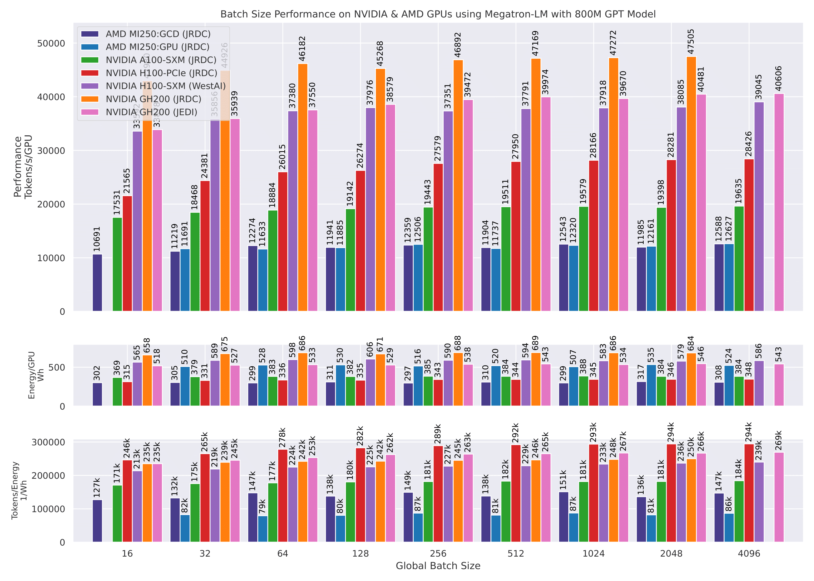
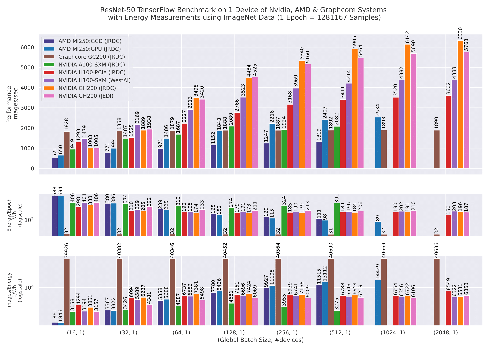

# CARAML 

**C**ompact **A**utomated **R**eproducible **A**ssessment of **M**achine **L**earning (**CARAML**)  is a benchmark framework designed to assess mainstream Computer Vision (CV) and Natural Language Processing (NLP) workloads on novel accelerators. It has been developed and extensively tested on systems at the Jülich Supercomputing Centre (JSC).

CARAML provides a compact and automated benchmarking tool that leverages [JUBE](https://apps.fz-juelich.de/jsc/jube/docu/index.html), a scripting-based framework for creating benchmark sets, running them across different systems, and evaluating results. Additionally, it includes power/energy measurements through the [jpwr](https://github.com/FZJ-JSC/jpwr) tool.

Paper: [Arxiv](https://arxiv.org/abs/2409.12994), [IEEE](https://ieeexplore.ieee.org/abstract/document/10820809)





## Tested Accelerators:

CARAML has been tested on the [JURECA-DC EVALUATION PLATFORM](https://apps.fz-juelich.de/jsc/hps/jureca/evaluation-platform-overview.html), [JURECA-DC](https://apps.fz-juelich.de/jsc/hps/jureca/configuration.html), [JEDI](https://apps.fz-juelich.de/jsc/hps/jedi/index.html#) and [WEST-AI Nodes](https://westai.de/services/hardware/). These include the accelerators: 

- AMD MI200 node with 4 $\times$ MI250 GPUs (`tag: MI250`)
- Graphcore IPU-POD4 M2000 with 4 $\times$ GC200 IPUs (`tag: GC200`)
- NVIDIA Ampere node (SXM) with 4 $\times$ A100 GPUs (`tag: A100`)
- NVIDIA Hopper node (PCIe) with 4 $\times$ H100 GPUs (`tag: H100`)
- NVIDIA Hopper node (NVLink) with 4 $\times$ H100 GPUs (`tag: WAIH100`)
- NVIDIA Grace-Hopper chip with 1 $\times$ GH200 GPU (`tag: GH200`)
- NVIDIA Grace-Hopper Node with 4 $\times$ GH200 GPUs (`tag: JEDI`)

# Benchmark

CARAML currently provides two main benchmarks implemented in Python:
### 1. Computer Vision: Image Classification (Training)
The [image_classification](./image_classification/) model training benchmark is implemented in PyTorch. It is designed to test image classification models such as ResNet50 on various accelerators. For IPU's [graphcore/examples](https://github.com/chelseajohn/examples) is used. Performance is measured in `images/sec` and energy is measured in `Wh`.

> **Note**: Support for the Image Classification benchmark in TensorFlow has been discontinued.

### 2. GPT Language Model (LLM Training)
The [LLM-training](./llm_training/) benchmark is implemented in PyTorch with:
- [Megatron-LM](https://github.com/NVIDIA/Megatron-LM.git) with commit: `f7727433293427bef04858f67b2889fe9b177d88` and [patch](./aux/nvidia_megatron_energy_llm_fix.patch) applied for NVIDIA
- [Megatron-LM-ROCm](https://github.com/bigcode-project/Megatron-LM.git) with commit: `21045b59127cd2d5509f1ca27d81fae7b485bd22` and [patch](./aux/amd_megatron_energy_llm_fix.patch) applied for AMD 
- [graphcore/examples](https://github.com/chelseajohn/examples) (forked version) for Graphcore

Performance is measured in `tokens/sec` and energy is recorded in `Wh`.

# Requirements

To run the benchmarks, you must install **JUBE**. Follow the [JUBE Installation Documentation](https://apps.fz-juelich.de/jsc/jube/docu/tutorial.html#installation) for setup instructions. The benchmarks are deployed using [Apptainer](https://apptainer.org/) containers and executed using **SLURM** on the tested accelerators.

### Dataset

- **Image Classification**: Synthetic data is generated on the host machine for benchmarking. The IPU tag `synthetic` additionally allows for the generation of synthetic data directly on the IPU.
  
- **LLM Training**: A subset of the [OSCAR dataset](https://huggingface.co/bigscience/misc-test-data/resolve/main/stas/oscar-1GB.jsonl.xz) (790 samples, ~10 MB) is pre-processed using [GPT-2 tokenizers](./llm_training/aux/tokenizers/). This data is provided in the `llm_data` directory.

# Execution 

Clone the repository and navigate into it:

```bash
git clone https://github.com/FZJ-JSC/CARAML.git
cd CARAML
```

###  Image Classification
- Modify `system`, `model` parameters in JUBE config
- To pull the required container use `container` tag as:
    ```bash
    jube run  image_classification/image_classification_torch_benchmark.xml --tag container H100
    ```
    For JSC systems `H100` can be replaced with  `GH200`, `MI250` and `GC200` as required.

- To run the benchmark with defined configurations do
    ```bash
    jube run image_classification/image_classification_torch_benchmark.xml --tag H100
    ```

    `H100` can be replaced with `A100`, `WAIH100`, `GH200`, `JEDI`, `MI250` and `GC200` as required.

- After the benchmark has been executed, use `jube continue` to postprocess results
    ```bash
   jube continue image_classification/image_classification_torch_benchmark._run -i last
   ```

- To generate result do:
   ```bash
  jube result image_classification/image_classification_torch_benchmark._run -i last
   ```

### LLM-Training
- Set the required `system` and `model` parameters  in [llm_benchmark_nvidia_amd.yaml](./llm_training/llm_benchmark_nvidia_amd.yaml)
for NVIDIA and AMD devices and in [llm_benchmark_ipu.yaml](./llm_training/llm_benchmark_ipu.yaml) for Graphcore

- To run the benchmark with defined configurations for `800M` GPT model with OSCAR data do:
    ```bash
    jube run llm_training/llm_benchmark_nvidia_amd.yaml --tag 800M A100
    ```
    `A100` can be replaced with `H100`, `WAIH100`, `GH200`, `JEDI` and `MI250` for the respective systems and `800M` can be replaced with `13B` and `175B` for systems with more node resources like `JEDI`, `H100`, `A100` and `MI250`.

- To run the benchmark with defined configurations for `117M` GPT model on Graphcore with synthetic data  do
    ```bash
    jube run llm_training/llm_benchmark_ipu.yaml --tag 117M synthetic
    ```
    If tag `synthetic` is not given, the benchmark will use OSCAR data

- After the benchmark has been executed, use `jube continue` to postprocess results
    ```bash
    jube continue llm_training/llm_benchmark_nvidia_amd_run -i last
   ```
 
- To generate result do:
   ```bash
   jube result llm_training/llm_benchmark_nvidia_amd_run -i last
   ```
  
 
# JSC Specific Fixes
In order to use PyTorch `torch run` API on JSC systems [fixed_torch_run.py](./llm_training/aux/fixed_torch_run.py) fix is required. The fix solves the issue defined [here](https://github.com/pytorch/pytorch/pull/81691).

Additionally the `hostname` is appended with an `i` for allowing communication over InfiniBand as described [here](https://apps.fz-juelich.de/jsc/hps/juwels/known-issues.html#ip-connectivity-on-compute-nodes).

# Citation

```
@INPROCEEDINGS{10820809,
  author={John, Chelsea Maria and Nassyr, Stepan and Penke, Carolin and Herten, Andreas},
  booktitle={SC24-W: Workshops of the International Conference for High Performance Computing, Networking, Storage and Analysis}, 
  title={Performance and Power: Systematic Evaluation of AI Workloads on Accelerators with CARAML}, 
  year={2024},
  pages={1164-1176},
  doi={10.1109/SCW63240.2024.00158}
  }

```